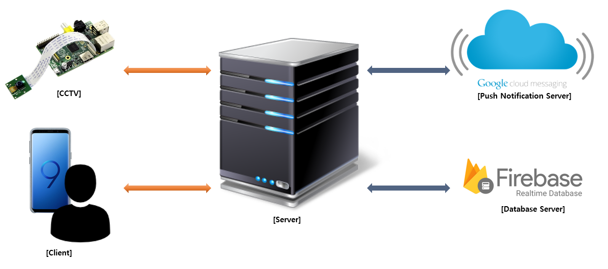
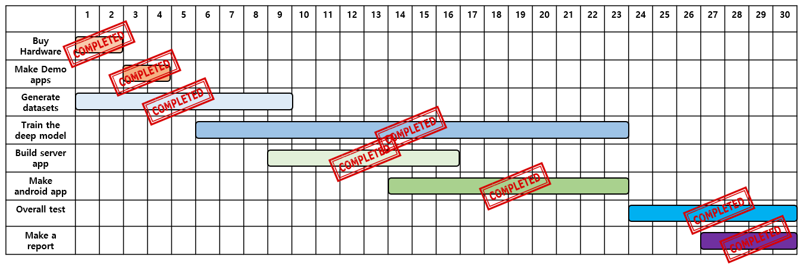

# NOTICE
<b>It will be moved to [OpenFDS](https://github.com/OpenFDS) organization on November 29.</b>

# 🔥 2018 OSS Fire Alarm CCTV 🔥
<h3><b>This is a repository for 2018 OSS Grand Developers Challenge (2018/09/01 ~ 2018/10/1)</b></h3>

# Demo(CCTV - Server - Client)

    
    
    

# Features
- Image streaming between Raspberry Pi and Python server.
- Fire detection & alarm
- Mobile application for uses
- Firebase Real-time database
- Firebase Cloud Messaging(FCM)

# System Architecture

    

# Timeline (2018/09/01 ~ 2018/09/30)

    

# TODO List

<b>18. Maintain & Upgrade this project.</b>
    
# DONE List
<b>1. Gather the information</b>
        
<b>2. Test Demo model on Raspberry Pi 3 B+</b>

<b>3. Make train dataset</b>
    
<b>4. First train custom model</b>

<b>5. Test model</b>

<b>6. If needed, increase a performance of the model</b>
    
<b>7. Make server application</b> 
    
    (Done: receive JSON data from android)

<b>8. Make client application</b> 
    
    (Done: Recycler Popup window, splash, Push alarm, HD, Call 119)

<b>9. System Test</b>

<b>10. Communication between Raspberry Pi and Python server.</b>

<b>11. Make a final report and demonstration video</b>

<b>12. Build train enviornment</b>

<b>13. Make up datasets for testing model's accuracy.</b>  

<b>14. Check clear commumication among Raspberry Pi, Python Server and Android Client </b>
   
<b>15. Design a user-friendly UI/UX on android client app</b>

<b>16. Make a database server </b>
    
<b>17. Additional functionality.</b>
    
    (Done: Server recording, and removing oldest file when it is expiring, Getting detection result from server using log)

<b>19. Build on AWS server for demonstration.</b>

<b>20. License validation</b>

<b>21. Function Test (10/31)</b>

<b>[DEMO]</b>

    - Make demo server and client(success connecting python server and android client using TCP socket.)

# Detection Results

    
    

    
# Useful Information
- The TOD(TensorFlow Object Detection) on the Raspberry Pi run environments are Tensorflow 1.9, cudNN 7.2.1 and cuda 9.0(Those are the best setting without error)
- Firebase library dosen't work in Python 3.7 

# Useful Links
- The Tensorflow official repository
    - https://github.com/tensorflow

- The method to transplant deep learning model on Raspberry pi 3
    - https://github.com/EdjeElectronics/TensorFlow-Object-Detection-on-the-Raspberry-Pi
    
- The method to train deep learning model using tensorflow object detecion API.
    - https://github.com/EdjeElectronics/TensorFlow-Object-Detection-API-Tutorial-Train-Multiple-Objects-Windows-10

- PyFCM
    - https://github.com/olucurious/PyFCM

- Python-Firebase
    - https://github.com/ozgur/python-firebase
