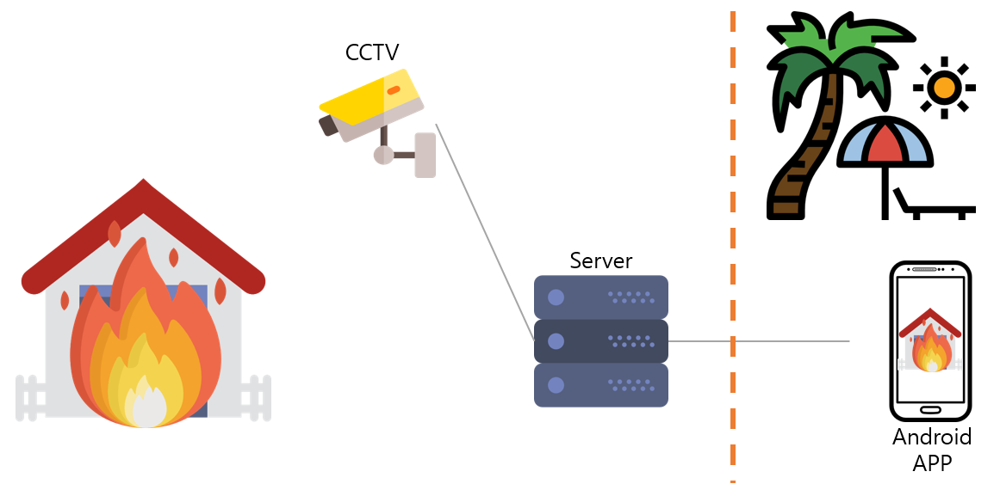
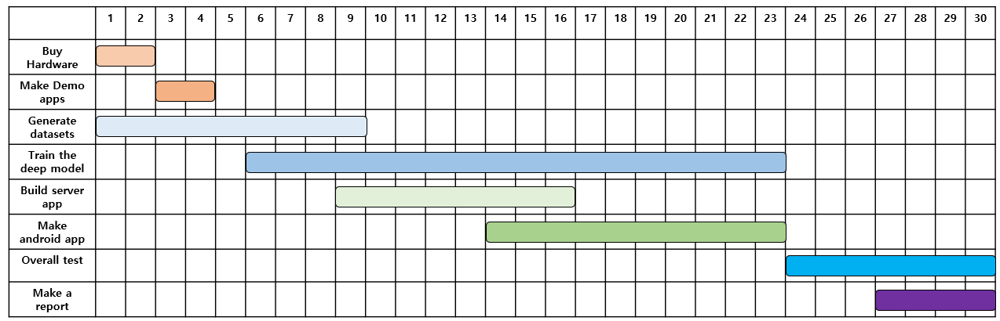
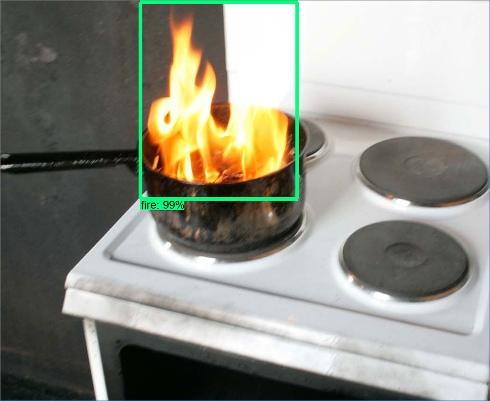
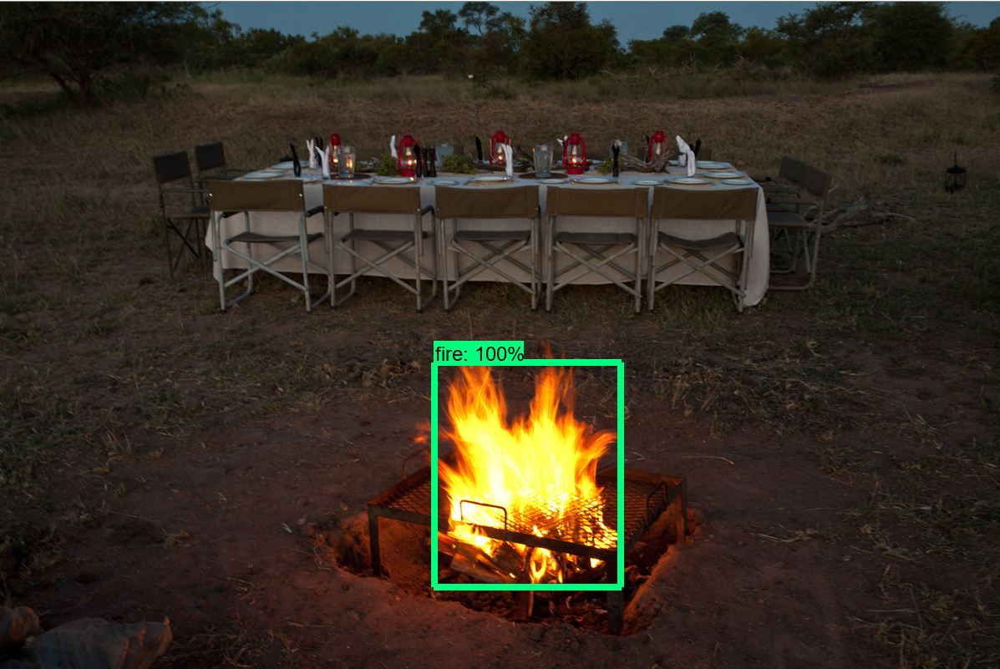

# 2018 OSS Fire Alarm CCTV
- This is a repository for 2018 OSS Grand Developers Challenge

# What functionality has the CCTV?
- It detects the fire situation and inform users of that. It shows the fire picture users so the user exactly can check it. It plans to use an artificial intelligence and an image processing methods.

# Overall Architecture

    

# Timeline

    

# TODO List        
<b>5. Test model</b>
    
    <currently working>
    
<b>6. If needed, increase a performance of the model</b>
    
    <currently working>
    
<b>9. System Test</b>

    <currently working>
    
<b>11. Make a final report and demonstration video</b>
    
    <currently working>
    
<b>13. Make up datasets for test to calculate model accuracy</b> 

    <currently working>

<b>16. Additional functionality.</b>
    
    (TODO: Server recording, sending detection result from log)
    
# Done
<b>1. Gather the information</b>

    - Check which Raspberry pi model and camera fits the project
        - I decided to buy Raspberry pi 3 B+, as It is improved by 17% than previous model, and pi camera because I heard that It uses GPU when processing an image.
    - How to transplant deep learning model on Raspberry pi 3
        - Check the link
    - Which deep learning model is used
    - Fire images
        - Use opened datasets, I assume that the number of images is 2,000 first.
    - What development environment you use to train the deep learning model
        - I will use AWS EC2 P3 Instance on Windows 10
        
<b>2. Test Demo model on Raspberry Pi 3 B+</b>

    - Succeeded run demo model on Raspberry Pi 3 B+, and the fps is about lower than 1.6
    
<b>3. Make train dataset</b>

    - Make train dataset(total 1815, will be splited into train and test)
    
<b>4. First train custom model</b>
    
<b>7. Make server application</b> 
    
    (Done: receive JSON data from android)

<b>8. Make client application</b> 
    
    (Done: Recycler Popup window, splash, Push alarm, HD, Call 119)
    
<b>10. Communication between Raspberry Pi and Python server.</b>
    
    - Should check if it is available for streaming images
        
<b>12. Build train enviornment</b>
    
<b>14. Check clear commumication among Raspberry Pi, Python Server and Android Client </b>
    
<b>15. Design a user-friendly UI/UX on android client app</b>

<b>16. Make a database server </b>

<b>[DEMO]</b>

    - Make demo server and client(success connecting python server and android client using TCP socket.)

# Train results
    - First train

    
    

# Useful Links
- The method to transplant deep learning model on Raspberry pi 3
    - https://github.com/EdjeElectronics/TensorFlow-Object-Detection-on-the-Raspberry-Pi
    
- The method to train deep learning model using tensorflow object detecion API.
    - https://github.com/EdjeElectronics/TensorFlow-Object-Detection-API-Tutorial-Train-Multiple-Objects-Windows-10
    
    
# Useful info
- The TOD(TensorFlow Object Detection) on the Raspberry Pi run environments are Tensorflow 1.5, cudNN 7.0 and cuda 8.0(Those are the best setting without error)
- Firebase library dosen't work in Python 3.7 

# Performance objectives
- The information should be gathered to decide performance of the CCTV, so I don't state it yet.

# God Bless You
